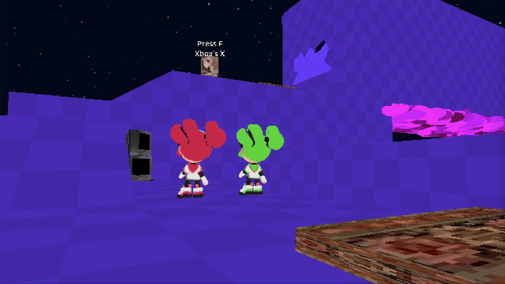
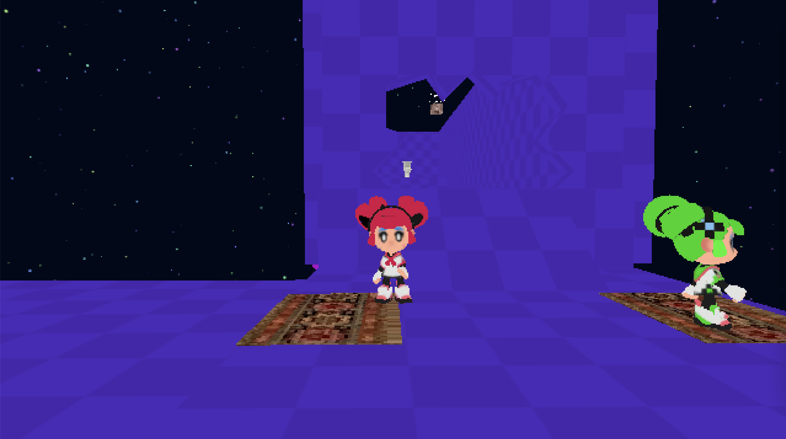

# Dream Together

Game for Omsk Ludum Dare 58

## Genre
Cooperative Split-screen 3D-platformer

## Synopsys
Two girls somehow got lost in cyberdream
They tries to reach reality by:
- collecting cats
- openning doors
- pulling and pushing boxes (and each other)
- saving respawn point at cat-chy TVs
- trying to make sense of the place where they appeared

## How to play:
- Open door with two pressing plates (they cover the floor and look fancy) to go for a flushing escape.
- There are two boxes on the map to keep the door open for both of you.
- Dying with box in hand would ressurect you with same box, fancy
- Box will return to spawn point if lost in pit below.
- Collect all the cats if you dare.

## Controls(Gamepads only):

- Left stick / WASD - character movement
- Right stick / Mouse - camera control

Buttons near right stick:
- Right button / E - ability (see below)
- Left button / F - interact (collect cats, grab/release boxes)
- Bottom button / SPACE - jump
- Upper button / TAB - swap character IN SINGLE PLAYER mode

## Abilities:

First player has ability to 'push' objects in front of him -  boxes and other player, specifically.

Second player has ability to 'pull' objects (boxes and other player)  to him.
Box would be in hand as result of pull.

